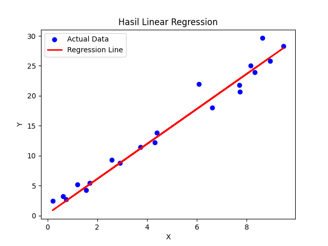

# linear-regression-api-fastapi
API sederhana menggunakan FastAPI dan Linear Regression (scikit-learn) untuk memprediksi nilai berbasis input numerik.

# Simple Linear Regression API

Proyek ini adalah implementasi sederhana dari **Linear Regression** menggunakan `scikit-learn`, kemudian disajikan melalui **API FastAPI**.

## 🚀 Fitur

- Membuat dataset sintetik (dummy)
- Melatih model Linear Regression
- Menyimpan model ke file `.pkl`
- Menyediakan REST API untuk prediksi

## 📁 Struktur Proyek

```
.
├── app.py              # FastAPI server untuk prediksi
├── main.py             # Training model dan menyimpan ke pickle
├── requirements.txt    # Semua dependency Python
├── .gitignore          # File/folder yang diabaikan Git
└── models/
    └── linear_model.pkl  # File model hasil training
```

## ⚙️ Instalasi

```bash
# 1. Clone repo ini
git clone https://github.com/username/linear-regression-api-fastapi.git
cd linear-regression-api-fastapi

# 2. Buat environment dan install dependency
pip install -r requirements.txt

# 3. Jalankan training
python main.py

# 4. Jalankan API server
uvicorn app:app --reload
```

## 📬 API Endpoint

### POST `/predict`

#### Request Body
```json
{
  "x": 5.5
}
```

#### Response
```json
{
  "prediction": 16.74
}
```

## 📊 Contoh Visualisasi
Output dari `main.py` menampilkan plot hasil prediksi regresi linear:




## 🧠 Teknologi
- Python
- scikit-learn
- FastAPI
- Pickle
- Matplotlib
- NumPy & Pandas

## 📌 Lisensi
Proyek ini menggunakan lisensi MIT. Bebas digunakan dan dimodifikasi.

---

Created with by Ariel Shakaramiro
